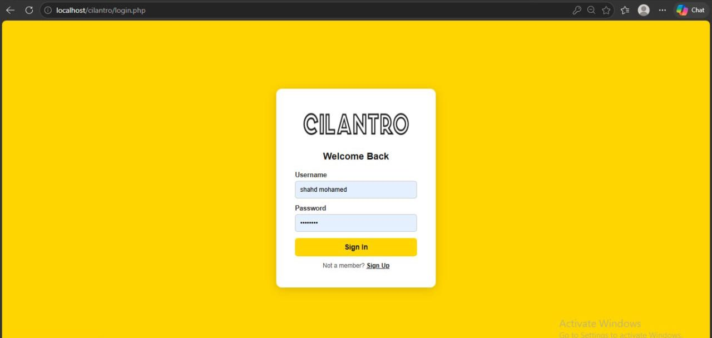
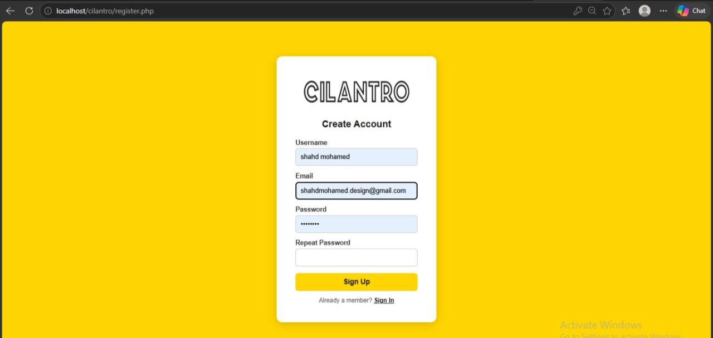
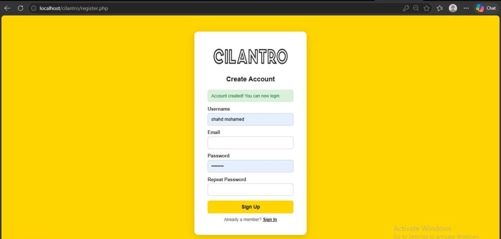
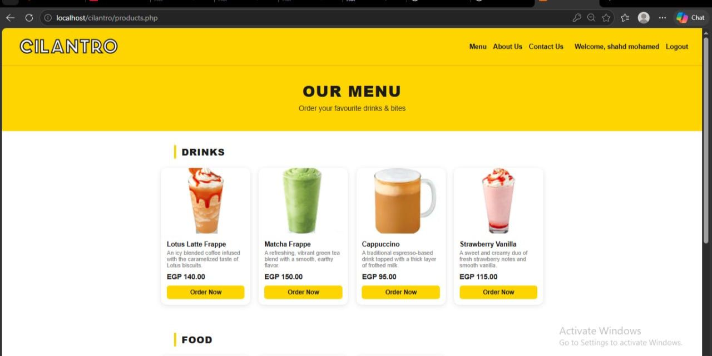
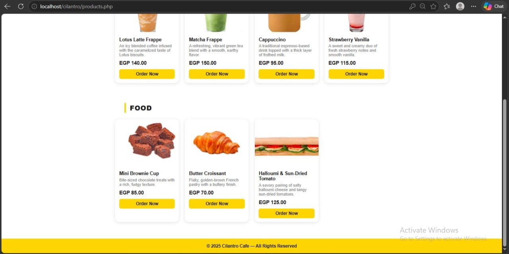
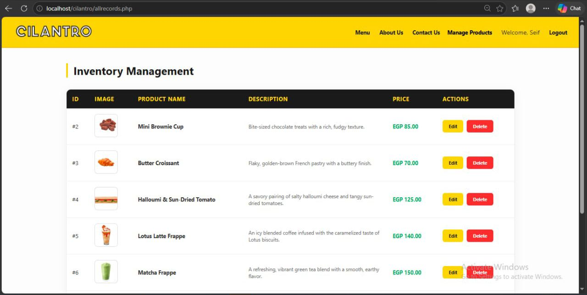
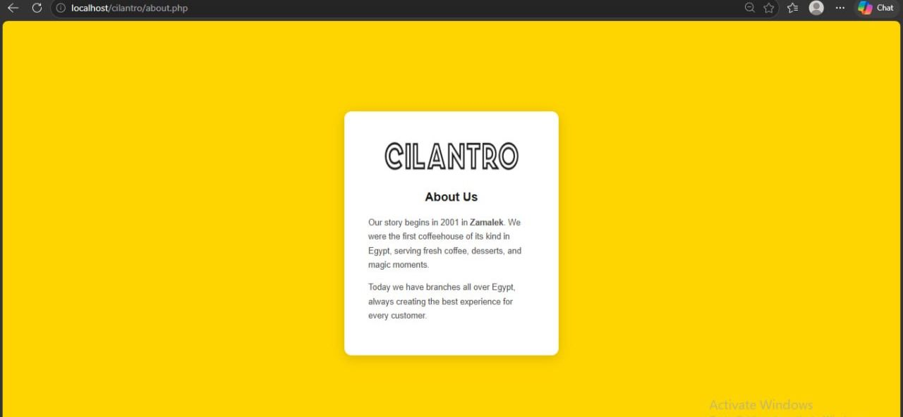
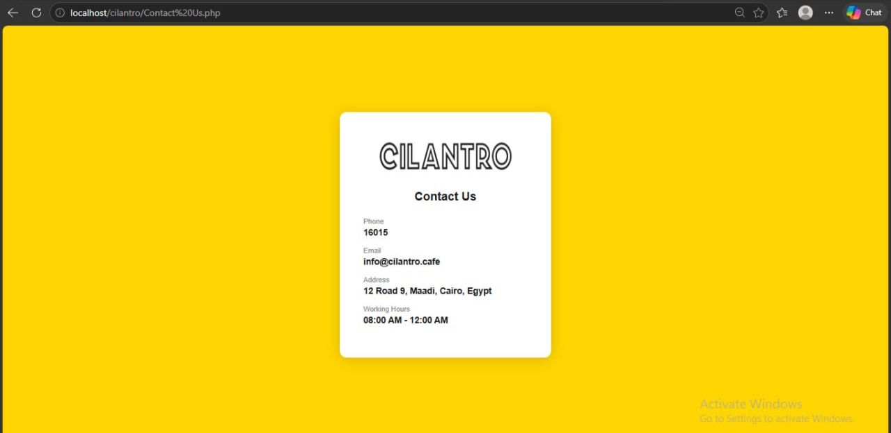
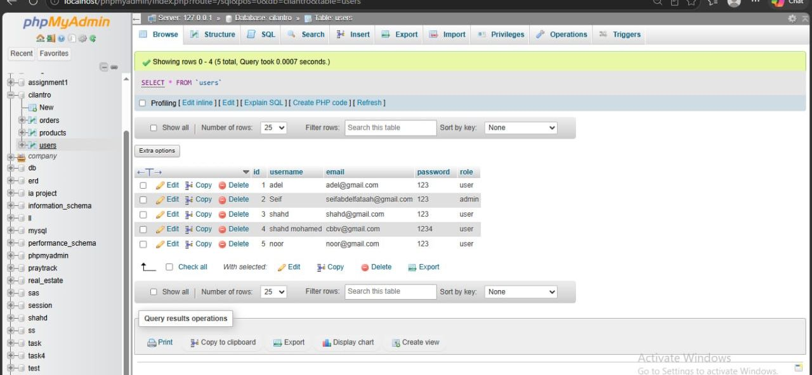
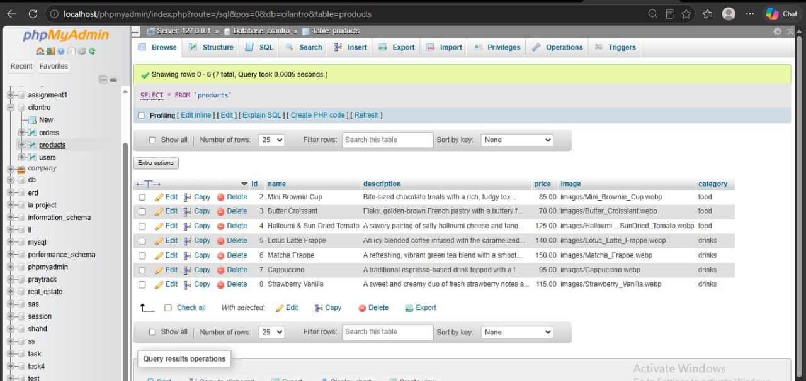

# Cilantro Cafe Web Application

## Project Overview
This is a full-stack web application built for Cilantro Cafe. It provides a seamless user experience for customers to browse the menu, place orders, and manage their accounts securely.

## Technologies Used
- **Backend:** PHP
- **Database:** MySQL
- **Frontend:** HTML, CSS, JavaScript
- **Server Environment:** XAMPP

## Key Features
- **User Authentication:** Secure registration and login system for users.
- **Dynamic Menu:** A product menu page displaying food and drinks, fetched dynamically from the MySQL database.
- **Order Management:** A smooth order confirmation flow for customers.
- **Product Management:** Admin capabilities to view, edit, and delete product records from the database.

---

## Project Screenshots

### User Authentication
User login and account creation interfaces ensuring secure access.

### Dynamic Menu & Products
Comprehensive display of available food and beverage options.

### Admin Dashboard & Inventory Management
Interface for administrators to manage product listings, including options to edit and delete items from the database.

### About Us & Contact
Information about the cafe's history and contact details.

### Database Management
Backend database tables managing user credentials and product inventory.

---

## How to Run Locally
1. Download and install XAMPP.
2. Clone this repository or download the ZIP file.
3. Move the project folder to the `htdocs` directory inside your XAMPP installation folder (usually `C:\xampp\htdocs`).
4. Start Apache and MySQL from the XAMPP Control Panel.
5. Create a database named `cilantro` in phpMyAdmin.
6. Open your browser and navigate to `http://localhost/cilantro/login.php` (adjust the folder name if necessary).
